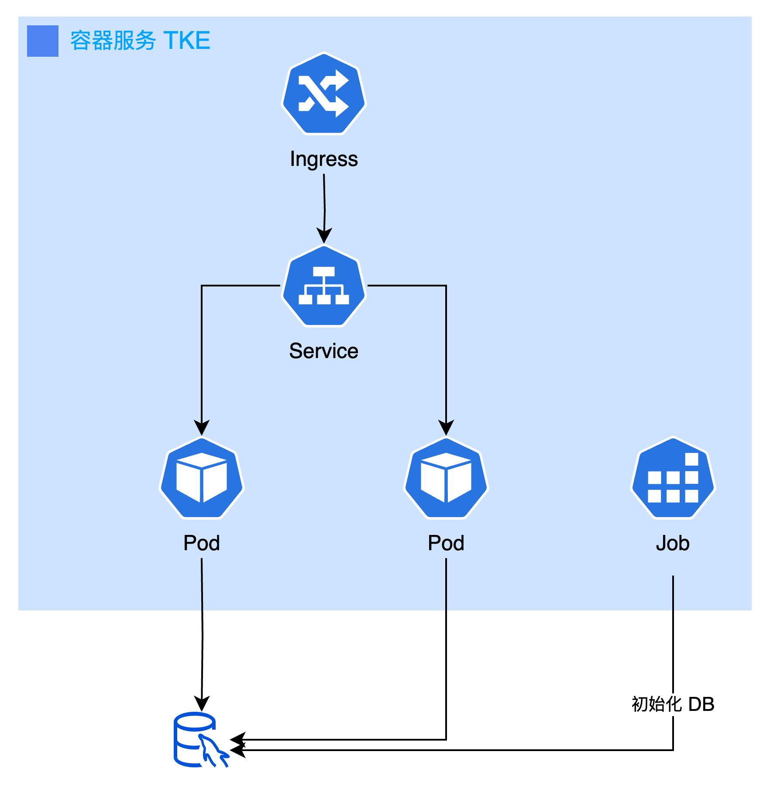

# 基于容器服务（TKE）的 todo-list 项目

## 简介

### 部署架构

### 容器架构

## 目录说明
- .cloudapp：云应用根目录
  - infrastructure：资源及变量定义目录
    - variable.tf：变量定义
    - deployment.tf：资源定义
    - provider.tf：全局公共参数（固定不变）
  - software: 容器应用源码，使用 helm chart 编排
  - package.yaml： 云应用配置文件
- frontend：前端源码，示例用，非强制当前目录
- server: 后台源码，示例用，非强制当前目录

## 云资源清单
* MySQL
* TKE（自动创建 CLB）

## 如何开始

## 参考文档
- [资源类型手册](https://cloud.tencent.com/document/product/1689/90938)
- [腾讯云云应用简介](https://cloud.tencent.com/document/product/1689/87047)